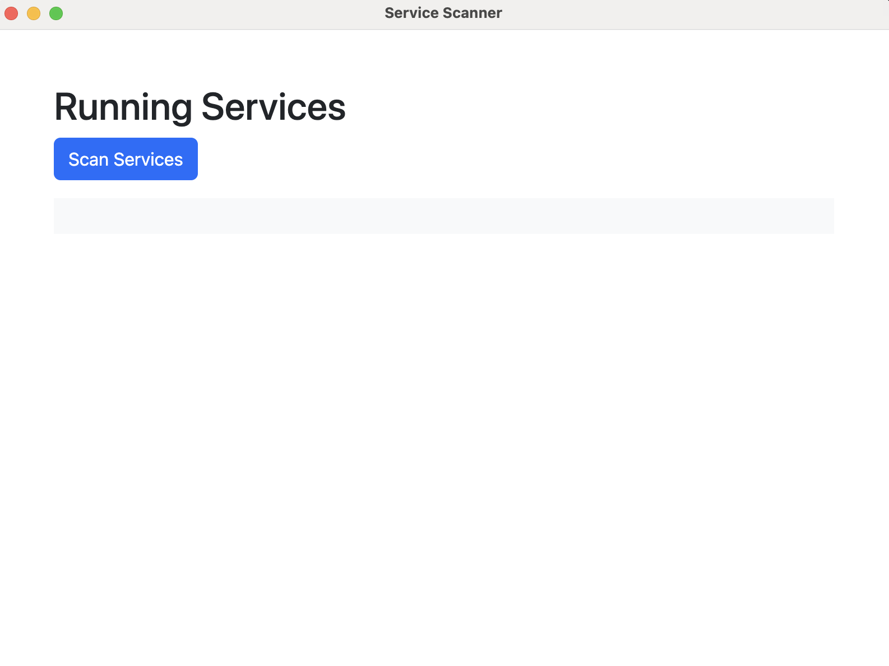
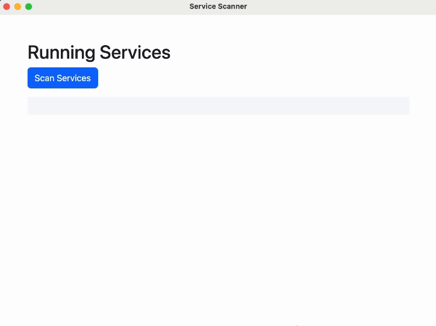
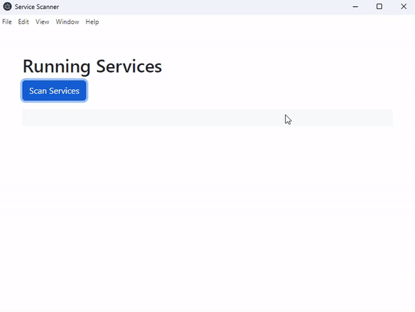

# Proof of Value Test 1: Basic Computer Service Scanning

## Mac

Steps followed for the test:

1. Run the app with `npm run start`.
   
2. Press "Scan Services"
   

## Windows

Steps followed for the test:

1. Run the app with `npm run start`.
   
2. Press "Scan Services"
   

## Linux (Ubuntu) (THIS TEST HAS NOT BEEN COMPLETED YET)

Steps followed for the test:

1. Run the app with `npm run start`.
2. Press "Scan Services"
