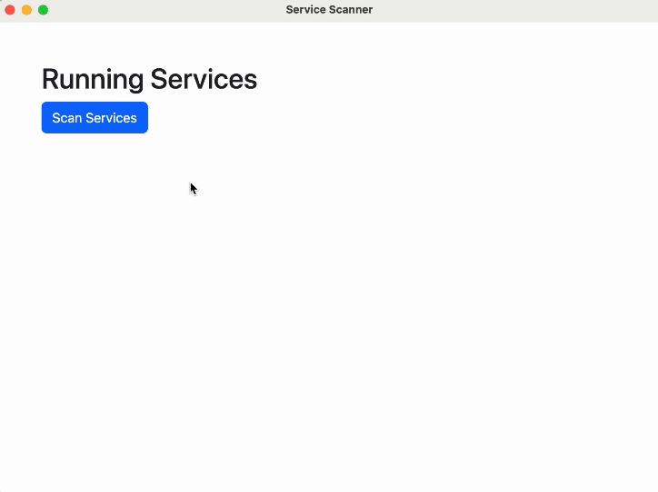
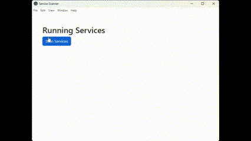
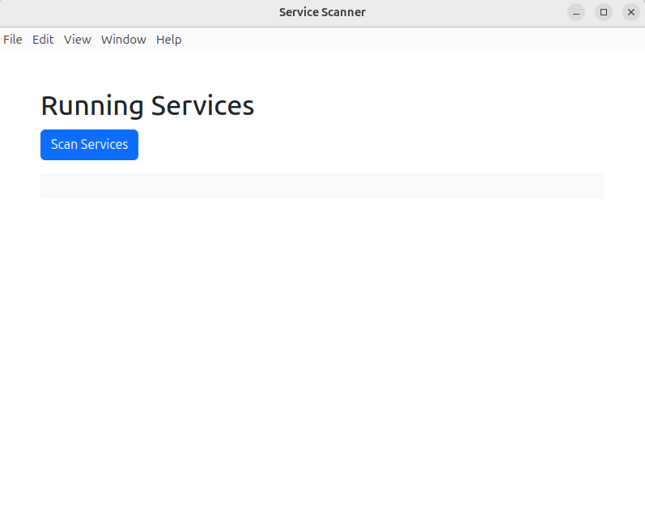
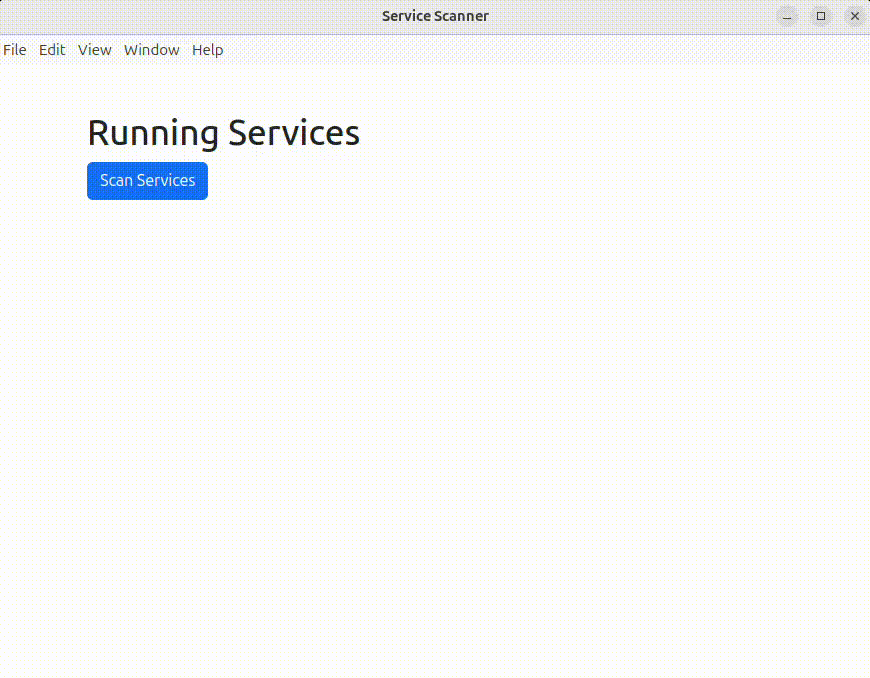
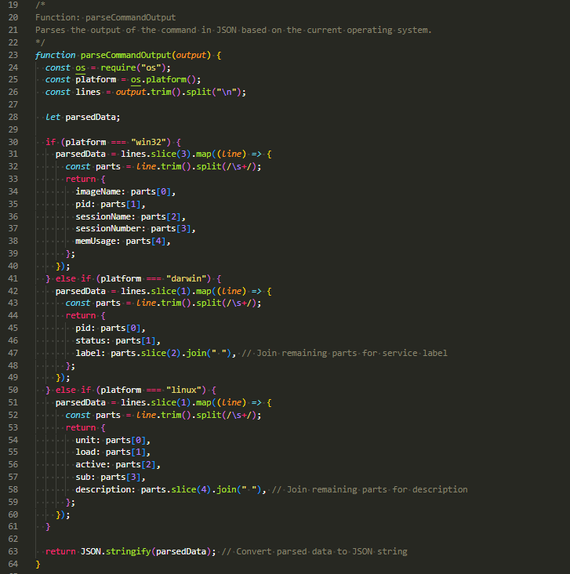
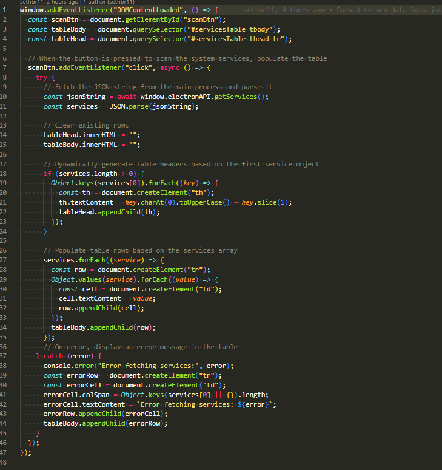

# Proof of Value Test 2: Parse Command Line Output into JSON/Table

The goal in this test was to format the command line output generated with the last test to JSON so we can more easily work with the data. In this test we just had our app insert the formatted output into a table, but in the future we will be able to look up specific services and status codes.

## Mac

Steps followed for the test:

1. Run the app with `npm run start`.

   

2. Press "Scan Services"

   

## Windows

Steps followed for the test:

1. Run the app with `npm run start`.

   

2. Press "Scan Services"

   

## Linux (Ubuntu)

Steps followed for the test:

1. Run the app with `npm run start`.

   

2. Press "Scan Services"

   

## Code to Parse Data into JSON/Table

1. Raw stdout from our service scanner command is parsed into an array of JSON objects

   

2. The JSON-ified raw stdout from the terminal is then parsed into an HTML table to be rendered

   
