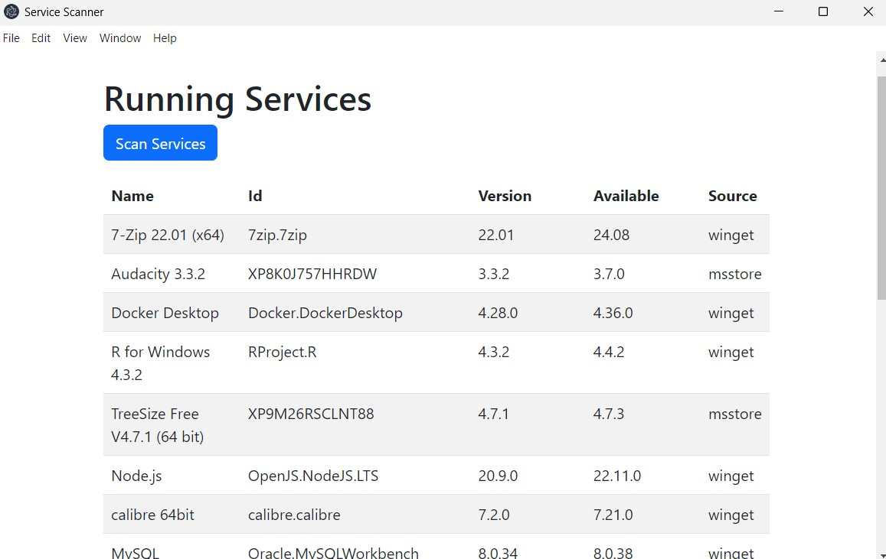
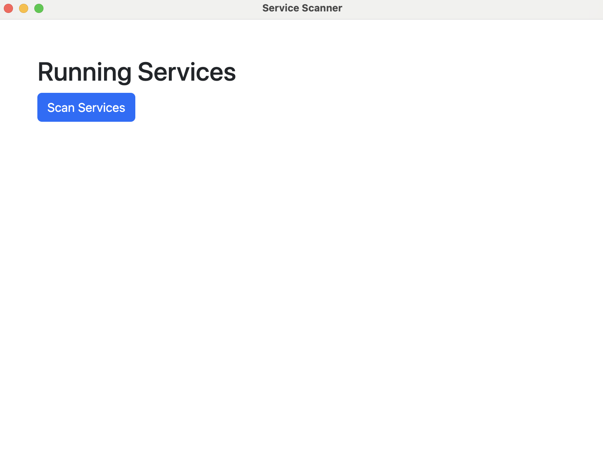
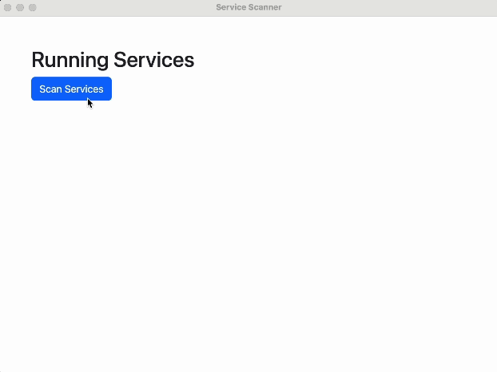

# Proof of Value Test 3: Display table of current applications that are out of date

The goal in this test was to get a list of installed applications and who the version number that is currently installed, and the most recent version number that can be installed. You can now easily see which applications on your PC are out of date and need to be updated.

## Windows

Steps followed for the test:

1. Run the app with `npm run start`.

   

2. Press "Scan Services"

   

   

## Mac

For Mac, we were not able to get version numbers for different apps. We could implement this in the future using Homebrew, though it is not a default service installed on Macs and the output would require significant adjustment. However, we were able to add baselines to check for and filter regarding default system services. This allowed us to shorten the ouputted list dramatically and simplify the output. These same baseline documents were added for Linux and Windows as well, but was only fully set up for Mac. These files can be found under [/patchthat/scripts/baselines](../../patchthat/scripts/baselines/).

Steps followed for the test:

1. Run the app with `npm run start`.

   

2. Press "Scan Services"

   
