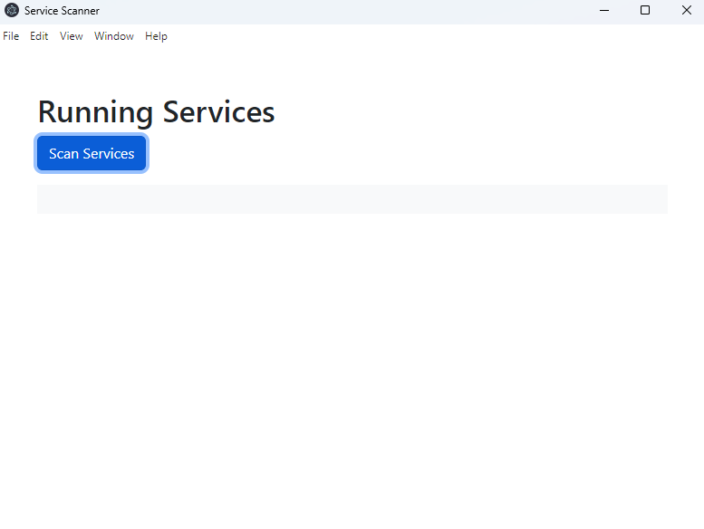
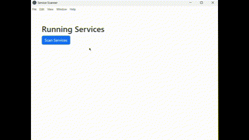

# Proof of Value Test 2: Parse Command Line Output into JSON/Table

The goal in this test was to get a list of installed applications and who the version number that is currently installed, and the most recent version number that can be installed. You can now easily see which applications on your PC are out of date and need to be updated.

## Windows

Steps followed for the test:

1. Run the app with `npm run start`.

   

2. Press "Scan Services"

   
